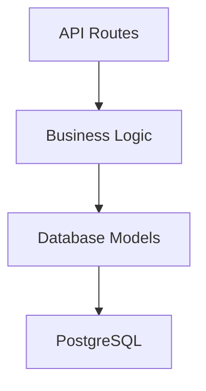

# DAG Service

Service for Working with Directed Acyclic Graphs (DAG).

---

## Technical Specification

Develop a FastAPI service for storing and displaying directed acyclic graphs (DAGs) (hereafter "the service") with PostgreSQL as the database.

### Technology Stack

* **Language**: Python 3.11
* **Framework**: FastAPI
* **Database**: PostgreSQL 13
* **ORM**: SQLAlchemy 2.0+ permitted (optional)

### Graph Requirements

The service must enforce these constraints. API attempts to create/modify graphs violating these requirements must return client errors. Error codes and messages must match the provided openapi.json specification.

1. **Graph must**:
    - Be directed and acyclic
    - Contain at least one node
2. **Node names must**:
    - Use only Latin characters
    - Be ≤255 characters
    - Be unique within a graph (duplicates allowed across different graphs)
3. **Only one edge permitted between any two nodes**

### API Specifications

1. **HTTP API** must fully comply with provided openapi.json:
    - Response codes and request schemas must match the specification exactly
2. **Scalability requirements**:
    - Support ≥1,000 concurrent graphs
    - Handle ≥100 nodes per graph
    - Manage ≥1,000 edges per graph
3. **Error handling**:
    - Database integrity violations must NOT return "500 Internal Server Error"
    - Error messages must be informative and actionable

### Graph Representation Examples

#### Node-Edge List
```json
{
    "nodes": [
        {"name": "a"},
        {"name": "b"},
        {"name": "c"},
        {"name": "d"}
    ],
    "edges": [
        {"source": "a", "target": "c"},
        {"source": "b", "target": "c"},
        {"source": "c", "target": "d"}
    ]
}
```

#### Adjacency List
```json
{
    "adjacency_list": {
        "a": ["c"],
        "c": ["d"],
        "d": [],
        "b": ["c"]
    }
}
```

#### Transposed Graph Adjacency List
```json
{
    "adjacency_list": {
        "a": [],
        "c": ["a", "b"],
        "d": ["c"],
        "b": []
    }
}
```

### Testing Requirements

- **≥80% test coverage** using pytest
- Utilize FastAPI's built-in TestClient
- Validate all constraint enforcement mechanisms
- Test edge cases (e.g., cycle creation attempts, duplicate nodes/edges)

---

## General Principles of DAG Service Operation

### Service Purpose

DAG Service is a FastAPI-based REST API for storing, processing, and validating directed acyclic graphs (DAGs) using PostgreSQL as the primary storage system. Designed for dependency management, process scheduling, relationship analysis, and other domains requiring DAG-based data representation.

### Key Features

- Create, store, and delete DAG graphs
- Retrieve graph metadata and structural information
- Obtain adjacency lists, vertices, and edges
- Validate graphs for acyclicity and structural integrity

### Technical Architecture

- **Language:** Python 3.11
- **Framework:** FastAPI
- **Database:** PostgreSQL 13+
- **ORM:** SQLAlchemy 2.0+
- **Migrations:** Alembic
- **Testing:** pytest

### Data Structure

- Graphs consist of **nodes** and **directed edges**
- Nodes have unique names (Latin characters, ≤255 chars) within a graph
- Only one directed edge permitted between any two nodes
- Cyclic connections prohibited (acyclicity validation enforced)

### Application Architecture

- Modular design: Separated API, business logic, models, schemas, and database layers
- Pydantic schemas for input/output validation
- Database operations via SQLAlchemy ORM with transaction support
- Alembic-managed schema migrations

### Infrastructure & Deployment

- Dockerized environment with separate API and PostgreSQL services
- Configurable via environment variables (e.g., `DATABASE_URL`)
- Interactive documentation at `/docs` (Swagger UI)
- Health check endpoint at `/health`

---

## Service Deployment Guide

### Prerequisites

1. Install **Docker** and **Docker Compose**
2. Clone repository:
   ```sh
   git clone [repository-url]
   cd dag-service
   ```
3. Create `.env` file from template:
   ```env
   # Mode
   START=1

   # Database
   POSTGRES_USER=your_user
   POSTGRES_PASSWORD=secure_password
   POSTGRES_DB=dag_db
   POSTGRES_HOST=db

   # API
   DATABASE_URL="postgresql://${POSTGRES_USER}:${POSTGRES_PASSWORD}@${POSTGRES_HOST}:5432/${POSTGRES_DB}"
   ```
4. Add test graph (Optional)
Run command: 
`docker-compose exec api bash`
`apt-get update && apt-get install -y curl && curl -i -X POST http://localhost:8000/api/graph/ -H "Content-Type: application/json" --data-binary @sample_data.json`

### Startup Commands

| Action | Command |
|--------|---------|
| Build & start | `docker-compose up -d --build` |
| Stop services | `docker-compose down` |
| View logs | `docker-compose logs -f` |
| Access API container | `docker-compose exec api bash` |
| Run migrations | `docker-compose exec api alembic upgrade head` |

### Verification

- **API Documentation:** `http://localhost:8080/docs`
- **Health Check:** `http://localhost:8080/health`

---

## Testing Framework

### Test Execution

| Test Type | Command |
|-----------|---------|
| Basic tests | `docker-compose run --rm -e START=2 api` |
| Coverage tests | `docker-compose run --rm -e START=3 api` |

**Key Testing Features:**
- Isolated test environment
- Fixtures for graph test data
- 90%+ code coverage enforcement

---

## Architectural Decisions

### 1. **Alembic Migration System**
Implemented beyond basic requirements to enable:
- Version-controlled schema changes
- Zero-downtime deployments
- Rollback capabilities

### 2. **Layered Architecture**
Separation into distinct components:


### 3. **Enhanced Validation Stack**
Multi-layer validation approach:
1. Pydantic schema validation
2. Business logic checks
3. Database constraints

### 4. **Lifespan Management**
FastAPI lifespan handler ensures:
- Proper connection pooling
- Graceful shutdowns
- Async resource initialization
